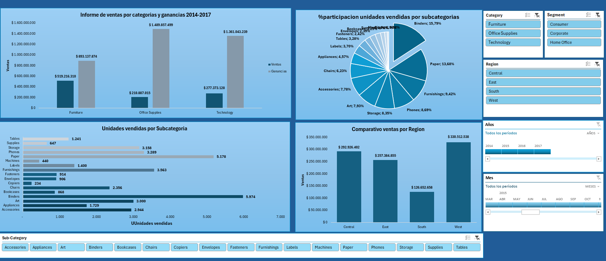

# 📊 Análisis de Ventas – SuperStore USA


---

## 📌 Descripción del Proyecto

Análisis exploratorio y visual de datos de ventas del dataset **SuperStore USA**, compuesto por **9.994 registros** de órdenes comerciales entre **2014 y 2017**. El proyecto incluye limpieza de datos, construcción de tablas dinámicas, generación de KPIs de negocio y un dashboard interactivo que permite identificar tendencias de ventas, rentabilidad por categoría y desempeño por región.

Este proyecto fue desarrollado como parte de mi portafolio profesional en análisis de datos, aplicando competencias en **Excel Avanzado**, **Power BI** y **pensamiento analítico orientado a negocio**.

---

## 🎯 Objetivos del Análisis

- Identificar las categorías y subcategorías de productos con mayor volumen de ventas y rentabilidad.
- Analizar el desempeño comercial por región geográfica (South, West, Central, East).
- Evaluar la evolución de ventas y ganancias entre 2014 y 2017.
- Detectar patrones de descuento y su impacto en el margen de ganancia.
- Construir un dashboard ejecutivo con KPIs clave para la toma de decisiones.

---

## 📁 Estructura del Archivo

```
SuperStore_E_f_Andres_felipe_diaz_campos.xlsx
│
├── 📄 Superstore       → Dataset original (9.994 filas × 21 columnas)
├── 📊 TD               → Tablas dinámicas con resumen por categoría
└── 📈 INFORME          → Dashboard interactivo con KPIs y gráficos
```

---

## 🗂️ Variables del Dataset

| Campo | Descripción |
|---|---|
| `Order ID` | Identificador único de la orden |
| `Order Date / Ship Date` | Fechas de pedido y envío |
| `Ship Mode` | Modalidad de envío (First Class, Second Class, etc.) |
| `Customer Name / Segment` | Cliente y segmento (Consumer, Corporate, Home Office) |
| `Region / State / City` | Ubicación geográfica del pedido |
| `Category / Sub-Category` | Clasificación del producto (Furniture, Office Supplies, Technology) |
| `Sales` | Valor de venta en USD |
| `Quantity` | Unidades vendidas |
| `Discount` | Porcentaje de descuento aplicado |
| `Profit` | Ganancia neta generada |

---

## 📊 Principales Hallazgos

| KPI | Valor |
|---|---|
| 📦 Total de órdenes analizadas | 9.994 |
| 💰 Ventas totales acumuladas | $1.007.476.453 USD |
| 📈 Ganancia total acumulada | $3.744.038.612 USD |
| 🗓️ Período analizado | 2014 – 2017 |
| 🌎 Regiones cubiertas | South · West · Central · East |
| 🏷️ Categorías de productos | Furniture · Office Supplies · Technology |

### Insights clave:
- **Office Supplies** generó la mayor ganancia acumulada, superando a Furniture y Technology.
- La región **West** concentra el mayor volumen de ventas del período.
- Los **descuentos altos** tienen correlación negativa con el margen de ganancia, especialmente en la categoría Furniture.
- El segmento **Consumer** representa el mayor número de transacciones.

---

## 🖥️ Dashboard

> 📸 *Vista previa del dashboard interactivo*



---

## 🛠️ Herramientas Utilizadas

- **Microsoft Excel Avanzado** – Limpieza de datos, tablas dinámicas, fórmulas (BUSCARV, SUMAR.SI, CONTAR.SI), formato condicional
- **Power Query** – Transformación y normalización del dataset
- **Gráficos dinámicos** – Visualización de tendencias y distribución por categoría y región
- **KPIs y segmentadores** – Filtros interactivos por año, región y categoría

---

## 🚀 Cómo usar este proyecto

1. Clona o descarga este repositorio:
```bash
git clone https://github.com/pipediaz1234/superstore-analisis-ventas.git
```
2. Abre el archivo `.xlsx` con **Microsoft Excel 2016 o superior**.
3. Dirígete a la hoja **INFORME** para visualizar el dashboard interactivo.
4. Usa los segmentadores para filtrar por año, región o categoría.

---

## 👤 Autor

**Andrés Felipe Díaz Campos**
Desarrollador de Software | Analista de Datos | Python | SQL | Power BI

- 🔗 [LinkedIn](https://www.linkedin.com/in/andres-felipe-diaz-campos-398245207)
- 💻 [GitHub](https://github.com/pipediaz1234)
- 📧 pipediazcampos1429@gmail.com

---

## 📂 Otros proyectos del portafolio

| Proyecto | Descripción | Tecnologías |
|---|---|---|
| [Portafolio Power BI](https://github.com/pipediaz1234/Portafolio-PowerBI) | Dashboards empresariales interactivos | Power BI, DAX |
| [Cierre de Caja](https://github.com/pipediaz1234/cierre-de-caja) | App web para gestión de ventas | Python, JavaScript |
| [Análisis Super18](https://github.com/pipediaz1234/analisis-de-ventas-Super18-italo-super-triunfo-) | KPIs comerciales reales | Python, Power BI |

---

*⭐ Si este proyecto te fue útil, considera darle una estrella al repositorio.*
